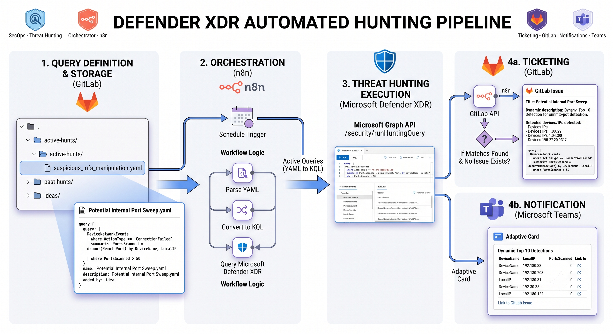

# 🛠️ Installation Guide: Automated Threat Hunting Pipeline

This guide details the steps required to configure and deploy the **Automated Threat Hunting pipeline**. This system retrieves KQL queries stored in a GitLab repository, executes them on Microsoft Defender XDR, logs any detections as GitLab Issues, and sends interactive notifications to Microsoft Teams.

---

## 🏗️ Global Architecture

The pipeline runs periodically on n8n to automate threat hunting scans and alert dispatching:



---

## 📋 Prerequisites & Access Rights

Before configuring n8n, you must configure access and retrieve credentials for Microsoft Entra ID, GitLab, and Microsoft Teams.

### 1. Microsoft Graph / Defender XDR (Entra ID)
To allow n8n to execute KQL queries on your Microsoft Defender XDR tenant, you need to register an application in Microsoft Entra ID.

1. Connect to the **Microsoft Entra admin center** (Azure Active Directory).
2. Go to **Applications** > **App registrations** > **New registration**.
   * **Name**: `n8n-Threat-Hunting-Pipeline`
   * **Supported account types**: *Accounts in this organizational directory only (Single tenant)*.
3. Go to **Certificates & secrets** > **New client secret**.
   * Copy and save the secret's **Value** immediately (it will only be shown once).
4. Go to **API permissions** > **Add a permission** > **Microsoft Graph**.
   * Select **Application permissions**.
   * Search for and check: `ThreatHunting.Read.All`
5. Click **Grant admin consent for [Your Organization Name]** (this is a mandatory step to activate application-level permissions).
6. Retrieve the following values from the application **Overview** page:
   * **Application (client) ID**
   * **Directory (tenant) ID**

---

### 2. GitLab Repository
The pipeline needs to read active KQL files and open Issues.

1. Create a **Personal Access Token** or a **Project Access Token** in GitLab.
   * Go to your profile settings or project settings > **Access Tokens**.
   * Check the scopes: `api` (or at least `read_repository` and `write_repository` + `api` for creating issues).
2. Save the generated **Access Token** (e.g., `glpat-...`).
3. Find your GitLab **Project ID** (visible on the project home page under the title). If your project is inside subgroups, use the URL-encoded path or numeric ID (e.g., `12345678` or `path%2Fto%2Fproject`).

---

### 3. Microsoft Teams (Webhook via Power Automate)
The pipeline sends interactive alerts.

1. In Microsoft Teams, create or choose a channel dedicated to security alerts.
2. Configure a **Power Automate** workflow (recommended since Microsoft is deprecating classic webhooks):
   * **Trigger**: "When an HTTP request is received".
   * **JSON Schema**: Leave blank or let it generate automatically.
   * **Action**: "Post an Adaptive Card in a chat or channel".
3. Retrieve the generated **HTTP POST URL**.

---

## 🚀 Step-by-Step Deployment

### 1. Import into n8n
1. Open your n8n instance.
2. Create a new Workflow.
3. Click the options menu (top right) > **Import from File** and load the `threat_hunting_workflow_template.json` file.

### 2. Configure the n8n Nodes

#### A. `Git Config` Node (Set Node)
Double-click the `Git Config` node to specify your GitLab variables:
* **`gitLabProjectId`**: The numeric ID or URL-encoded path of your GitLab project (e.g., `code%2Fit-security%2Fdetection%2Fhunting`).
* **`branch`**: The Git branch holding your threat hunts (usually `main`).
* **`folderPath`**: The sub-folder containing active KQL hunts (`active-hunts`).

#### B. GitLab HTTP Requests Configuration
The workflow contains 4 HTTP Request nodes interacting with GitLab:
* `List Git Files`
* `Get File Content`
* `GitLab Search Issue`
* `GitLab Create Issue`

For each of these nodes:
1. Open the node and look at the **Headers** section.
2. Replace the default value of the `PRIVATE-TOKEN` header with your GitLab access token.
> 💡 *Production Tip*: It is highly recommended to use n8n's **Header Auth** credentials or global variables to manage this token instead of hardcoding it in multiple nodes.

#### C. `Defender XDR KQL Query` Node (Microsoft Graph)
This node executes the query on Microsoft's API using custom OAuth2 credentials.
1. In the **Credential for OAuth2 API** parameter, click the dropdown and choose **Create New Credential**:
   * **Grant Type**: `Client Credentials`
   * **Access Token URL**: `https://login.microsoftonline.com/{YOUR_TENANT_ID}/oauth2/v2.0/token` (replace `{YOUR_TENANT_ID}` with your Azure Tenant ID).
   * **Client ID**: The Entra ID Application (client) ID.
   * **Client Secret**: The client secret generated in Entra ID.
   * **Scope**: `https://graph.microsoft.com/.default`
2. Save and test the credentials.

#### D. `Teams Notification` Node
1. Double-click the `Teams Notification` node.
2. Replace the URL in the **URL** parameter with your Teams HTTP POST URL or Webhook.

### 3. Activate the Workflow
1. Verify the **Schedule Trigger** node is configured to run at your desired interval. By default, it triggers every 1 hour.
2. Toggle the workflow to **Active** (top right corner).

---

## 📝 Query Format and Lifecycle

Each hunt file in the Git repository must adhere to this exact YAML schema:

```yaml
name: "Potential Internal Port Sweep"
description: "Identifies internal port sweeps based on high volume of failed connections."
added_by: "Robin"
schedule: "daily" # Execution frequency: hourly, daily, or weekly (default: daily)
query: |
  DeviceNetworkEvents
  | where Timestamp > ago(1d) // Important: Align this timeframe with your schedule frequency!
  | where ActionType == 'ConnectionFailed'
  | summarize PortsScanned = dcount(RemotePort) by DeviceName, LocalIP
  | where PortsScanned > 50
```

### Execution Scheduling Rules (`Parse YAML` Node):
The execution workflow triggers hourly on n8n and filters files based on the `schedule` parameter inside the YAML file:
* **`hourly`**: Executed every hour (24/7).
* **`daily`**: Executed once per day at **08:00 AM** (Zurich/Paris time).
* **`weekly`**: Executed once per week on **Mondays at 08:00 AM**.

> [!WARNING]
> **KQL Timeframe Filter is Mandatory**
> Always add a KQL timeframe filter (like `| where Timestamp > ago(1d)`) matching your `schedule` to prevent duplicate alerts and avoid overloading the Microsoft Graph API.
